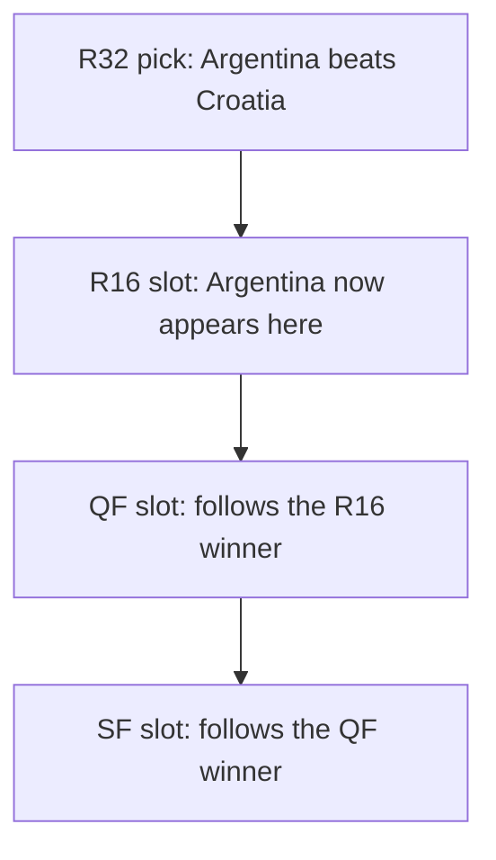

When you create a pool — or update its rules — you decide when your members can no longer change their predictions. This guide walks through every option, what each one means for your members, and how to choose well.

## The three states a prediction can be in

Every prediction (a group game or a knockout slot) sits in one of three states at any given moment:

<CardGroup cols={3}>
  <Card title="Pending" icon="hourglass-half">
    The matchup hasn't been decided yet — one or both teams are still TBD. Members can't predict yet.
  </Card>
  <Card title="Open" icon="circle-check">
    Teams are confirmed and the deadline hasn't passed. Members can submit or edit.
  </Card>
  <Card title="Locked" icon="lock">
    The deadline has passed. No more changes — by anyone, including you.
  </Card>
</CardGroup>

<Note>
The *predict window* for a given game is the time during which it's **both** Open *and* not yet Locked. For knockout matchups, this window can be much narrower than your lock setting suggests — see [The TBD problem](#the-tbd-problem-knockouts-only) below.
</Note>

## The one rule that governs every lock

> **A prediction locks at the earliest of: the match's own kickoff, the stage's deadline, or the bracket deadline (if applicable).**

That's it. Every option below is a way of choosing when those deadlines fall.

## Per-stage lock options

For each stage of the tournament, you pick one of three lock modes:

<CardGroup cols={3}>
  <Card title="Per Match" icon="clock">
    Each game locks at its own kickoff. Maximum flexibility — members can predict right up to the whistle.
  </Card>
  <Card title="Stage Start" icon="flag-checkered">
    All games in the stage lock together — the moment the stage's first game kicks off.
  </Card>
  <Card title="Custom" icon="calendar">
    All games in the stage lock on a date you choose.
  </Card>
</CardGroup>

### Which one should you pick?

<Tip>
**Casual pool with friends or coworkers?** → **Per Match**. Lets people drop in predictions throughout the tournament without pressure.

**Skill-based pool with real stakes?** → **Stage Start**. Nobody gets to predict the last game of a stage after seeing how the earlier ones went.

**Want a ceremony — everyone in by a single date?** → **Custom**. Great for "draft night" energy.
</Tip>

### Quirks to know

**The per-match floor always applies.** Even if you pick Stage Start with a date that falls *after* a game's kickoff, the per-match kickoff still wins. Members can never predict a game after it has started.

<Warning>
**Be careful when picking Custom dates.** If your Custom date falls *before* some matchups in that stage are even known — because the earlier rounds that feed them haven't finished — those games become impossible to predict. This is especially risky for knockout stages. Open the tournament schedule in another tab when setting Custom dates.
</Warning>

## Cascading Bracket — a fundamentally different mode

Most pools predict each game one at a time. Cascading Bracket is different: members predict the **entire knockout bracket** in one sitting, before any knockout game kicks off, and their picks **cascade** through the rounds.

If a member picks Argentina to beat Croatia in R32, Argentina automatically appears as the team they're predicting in their R16 slot. The picks flow downstream:



If they change their R32 pick later, the downstream slots that depended on it are **cleared so they can re-pick** — because the matchup they originally predicted doesn't exist anymore.

<Note>
Cascading Bracket still requires score predictions, like every other mode. Members pick a winner *and* a scoreline for each knockout matchup — the cascade just controls which matchup appears in each downstream slot.
</Note>

### What changes when you turn it on

<Steps>
  <Step title="Knockout per-stage lock options disappear">
    There's no Per Match / Stage Start / Custom choice for R32, R16, QF, SF, or the final. All knockout predictions lock together.
  </Step>
  <Step title="A single Bracket Lock Deadline appears">
    By default it's set to the exact kickoff of the first knockout game.
  </Step>
  <Step title="The group stage works normally">
    Group games keep their own lock setting. Cascading Bracket only changes knockouts.
  </Step>
</Steps>

### When to choose it

<Check>
**Pick Cascading Bracket if you want the one-shot bracket prediction feel** — the kind people gather for, debate over, and screenshot. It rewards conviction and punishes uncertainty.
</Check>

<Warning>
**Don't pick it for casual pools.** A member who misses the bracket deadline can't predict *any* knockout game for the rest of the tournament — not just one.
</Warning>

For the full mechanics of how points cascade with team advancement, see [Bracket pools](/en/guides/bracket-pools).

## The TBD problem (knockouts only)

Group stage matchups are confirmed before the tournament starts, so they're never pending. But **knockout matchups depend on earlier results**, so they show as TBD until those results come in.

Two details that matter:

- We update knockout matchups **2 hours after each feeding game ends**. A scheduled worker waits this long to give our data provider time to confirm the result.
- That means the matchup for the very last knockout slot of a round isn't predictable until 2 hours after the last feeding game ends.

### How this hits each lock mode

| Lock mode | Risk | Worst case for members |
|-----------|------|------------------------|
| **Per Match** | Low | A late-confirmed matchup gives only a few hours before kickoff. Members miss one game. |
| **Stage Start** | Medium | If a matchup confirms close to the stage's first kickoff, the predict window for that game might be only a few hours. Members miss one or two games. |
| **Custom** | High | If your Custom date is before some matchups confirm, those games can't be predicted at all. |
| **Cascading Bracket** | Highest | Late-confirmed slots only become predictable hours before the bracket-wide deadline. Members can lose a whole branch of their bracket if they don't return in time. |

### Real-world example: World Cup group → R32

The last group game of a World Cup typically ends around 10pm the night before R32 starts. R32 begins at 12pm the next day:

```
 June 27                                    June 28
─────────────────────────────────────────────────────────
 ~7pm        ~10pm     midnight                    12pm
  │            │          │                          │
  ▼            ▼          ▼                          ▼
 Last        Game       Late-confirmed             Bracket
 group       ends       R32 matchups               deadline +
 game                   become                     first R32
 kicks off              predictable                kicks off
                        (2h after game end)
```

**For Cascading Bracket pools**, that gives members from midnight to noon — about **12 hours** — to fill in the late-confirmed slots and finalize their bracket. Most of that is overnight. **The morning of the first R32 day is the make-or-break window** for any member who hasn't already submitted a complete bracket.

**For non-cascading pools** with Stage Start lock, the calendar is the same, but consequences aren't. Missing the window costs members **one or two specific games** rather than a whole branch.

<Info>
We send reminder notifications ahead of bracket deadlines and stage starts, so members aren't relying on memory alone. Members can read the full member-facing version of this content in [When can I make my predictions?](/en/when-can-i-predict).
</Info>

## Editing the rules later

You can change rules — lock modes, dates, even Cascading Bracket on/off — **up until the first match of the tournament kicks off**. After that, rules are frozen for the rest of the tournament. This protects every member who already submitted under the original rules.

## FAQ

<AccordionGroup>
  <Accordion title="What does 'lock' actually mean?">
    A locked prediction can't be created or edited — by the member, by you, or by anyone. Locks are enforced on our servers, not just in the UI. After a lock, only the scoring engine touches the prediction.
  </Accordion>
  <Accordion title="Can I change a deadline that's already passed?">
    No. Once a lock has triggered, that window is closed for the rest of the tournament. You also can't change any other rule once the tournament's first match has kicked off.
  </Accordion>
  <Accordion title="What if a member misses a deadline?">
    Predictions they submitted before the deadline still count. Games they didn't predict simply earn zero points for those games — there's no penalty to their overall score beyond the missed opportunity.
  </Accordion>
  <Accordion title="Why is a matchup still TBD if the feeding game already ended?">
    We wait 2 hours after a feeding game ends before updating the matchup. The delay gives our data provider time to confirm the official result before we propagate it.
  </Accordion>
</AccordionGroup>
