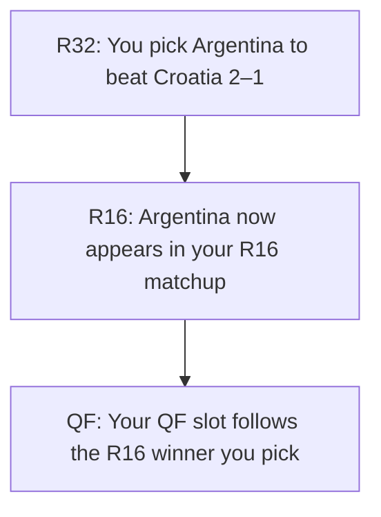

This guide explains everything about prediction deadlines: when they happen, what they look like in the app, and what to do when a matchup hasn't been decided yet.

## The three states a prediction can be in

When you open a pool, every game (group stage or knockout) shows one of three states:

<CardGroup cols={3}>
  <Card title="Pending" icon="hourglass-half">
    The matchup isn't decided yet. One or both teams are TBD. You'll be able to predict once earlier games confirm who plays who.
  </Card>
  <Card title="Open" icon="circle-check">
    You can submit or edit your prediction.
  </Card>
  <Card title="Locked" icon="lock">
    The deadline has passed. Your prediction (if any) is final.
  </Card>
</CardGroup>

Each game in your predictions list has a clear visual indicator showing which state it's in.

## When does each game lock?

That depends on what your pool's organizer chose when setting it up. Pools have one of these settings:

### Per Match
Each game locks at **its own kickoff**. You can predict right up until the moment the game starts.

### Stage Start
All games in a stage lock at the same time — **when the stage's first game kicks off**. So when the first group game starts, every group prediction locks together.

### Custom
All games in a stage lock on a **specific date** the organizer chose. You'll see the exact date at the top of the stage in your predictions screen.

### Cascading Bracket
Your pool has **one bracket-wide deadline** for all knockout predictions. By default it's set to the kickoff of the first knockout game. (Cascading Bracket pools work very differently — keep reading.)

<Tip>
Not sure what your pool uses? Open the pool's home screen — the lock mode is shown at the top of the predictions tab, along with the next upcoming deadline.
</Tip>

## Cascading Bracket pools

If your pool is a Cascading Bracket pool, you'll see this prominently on its home screen. The experience is different enough from regular pools that it gets its own section.

### How predicting the bracket works

You predict the **entire knockout bracket in one go**, before any knockout game kicks off. You pick a winner *and* a scoreline for each R32 matchup; that winner automatically appears in your R16 matchup; your R16 winner cascades to your QF slot; and so on through the final.



Score predictions are required at every round, just like in any other Toqui mode. The cascade only controls *which* matchup appears in each downstream slot — you still pick a scoreline for it.

### What if I change my mind about an earlier pick?

If you change an R32 pick after you've already filled in R16, the R16 slot that depended on it gets **cleared** so you can re-pick. We do this because the matchup you originally predicted no longer makes sense — the team isn't there anymore.

You can keep changing your mind right up until the bracket deadline. After the deadline, your bracket is final.

### When does the bracket lock?

**At the kickoff of the first knockout game.** Once that game starts, your entire bracket is frozen — no more changes to any pick, in any round.

<Warning>
This is a **single deadline for every knockout pick** — R32 through the final. If you miss it, you can't predict any knockout games for the rest of the tournament.
</Warning>

## Why some matchups are TBD

Knockout matchups depend on earlier results. Until those results are in, the matchup shows as TBD and you can't predict it yet.

**We confirm matchups 2 hours after each feeding game ends.** The delay gives our data provider time to verify the official result before we update your bracket.

So if a group game ends at 10pm, the knockout slots that depend on it become predictable around midnight.

### The transition window — when timing gets tight

The tightest moment in any tournament is **the transition from group to knockout**. Here's what a typical World Cup transition looks like:

```
 June 27                                    June 28
─────────────────────────────────────────────────────────
 ~7pm        ~10pm     midnight                    12pm
  │            │          │                          │
  ▼            ▼          ▼                          ▼
 Last        Game       Last R32                   Bracket
 group       ends       matchups                   deadline +
 game                   confirm                    first R32
 kicks off              (2h after                  kicks off
                        game end)
```

If you're in a **Cascading Bracket pool**, you have from midnight to noon — roughly **12 hours** — to finalize any bracket slots that depended on that last group game. Most of that is overnight, so **plan to be online the morning of the first R32 day and finalize before noon.**

If you're in a **non-cascading pool**, you have the same midnight-to-noon window for those specific games, but missing it only costs you those games — the rest of your stage predictions are unaffected.

<Info>
We send notifications 24 hours before bracket deadlines and stage starts so you don't have to remember every date yourself. Just don't rely on them as your only safety net.
</Info>

## FAQ

<AccordionGroup>
  <Accordion title="What happens if I miss a deadline?">
    Any predictions you submitted before the deadline still count. Games you didn't predict simply earn zero points for those games — there's no penalty to your overall score beyond the missed opportunity.
  </Accordion>
  <Accordion title="Why is a matchup still TBD if the game already ended?">
    We wait 2 hours after a feeding game ends before updating the matchup. The delay lets our data provider confirm the official result. If it's been longer than 2 hours and the slot is still TBD, refresh — the update may have just landed.
  </Accordion>
  <Accordion title="Can I change my prediction after I submit?">
    Yes, anytime before its lock. Your most recent submission is what counts.
  </Accordion>
  <Accordion title="The organizer changed the rules — what happens to my predictions?">
    Organizers can adjust rules until the first match of the tournament kicks off. Your existing predictions stay, but any new deadlines will apply from the moment of the change.
  </Accordion>
</AccordionGroup>
