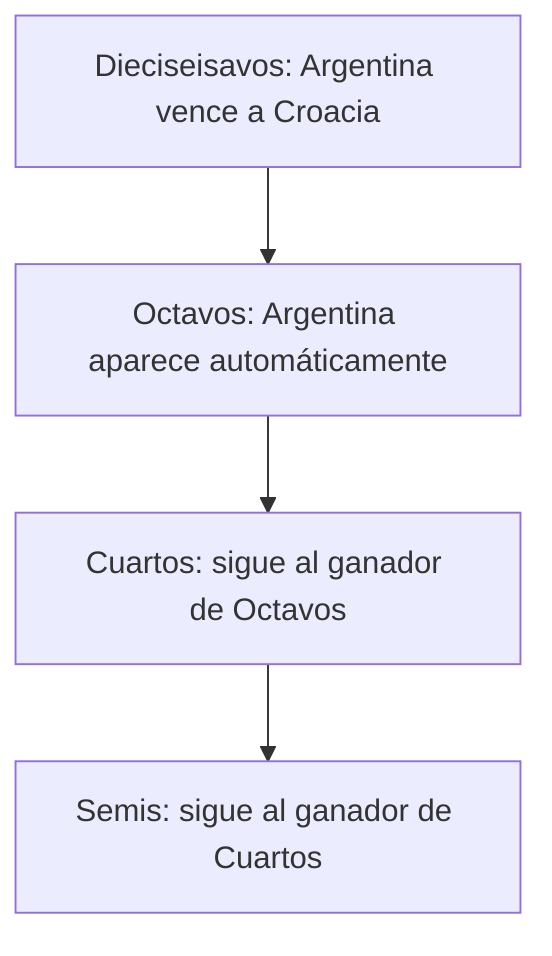

Cuando creás un Juego — o actualizás sus reglas — decidís hasta cuándo tus miembros pueden cambiar sus predicciones. Esta guía recorre cada opción, qué significa para tus miembros y cómo elegir bien.

## Los tres estados de una predicción

Cada predicción (un partido de la fase de grupos o una llave eliminatoria) está, en cualquier momento, en uno de tres estados:

<CardGroup cols={3}>
  <Card title="Pendiente" icon="hourglass-half">
    El cruce todavía no está definido — una o ambas selecciones siguen POR DEFINIR. Los miembros aún no pueden predecir.
  </Card>
  <Card title="Abierta" icon="circle-check">
    Las selecciones están confirmadas y el plazo no ha pasado. Los miembros pueden enviar o editar.
  </Card>
  <Card title="Cerrada" icon="lock">
    El plazo ya pasó. No hay más cambios — para nadie, ni siquiera para vos.
  </Card>
</CardGroup>

<Note>
La *ventana de predicción* de un partido es el tiempo durante el cual está **a la vez** Abierta *y* aún no Cerrada. Para las llaves eliminatorias, esa ventana puede ser mucho más corta de lo que sugiere tu configuración de cierre — ver [El problema de las llaves POR DEFINIR](#el-problema-de-las-llaves-por-definir-solo-eliminatoria) más abajo.
</Note>

## La única regla que rige todo cierre

> **Una predicción se cierra en el primer momento entre: el inicio del propio partido, el plazo de la etapa, o el plazo del bracket (si aplica).**

Eso es todo. Cada opción de abajo es una forma de decidir cuándo caen esos plazos.

## Opciones de cierre por etapa

Para cada etapa del torneo, elegís uno de tres modos de cierre:

<CardGroup cols={3}>
  <Card title="Por partido" icon="clock">
    Cada partido se cierra al iniciar. Máxima flexibilidad — los miembros pueden predecir hasta el pitazo inicial.
  </Card>
  <Card title="Inicio de etapa" icon="flag-checkered">
    Todos los partidos de la etapa se cierran juntos — apenas arranca el primer partido de esa etapa.
  </Card>
  <Card title="Personalizado" icon="calendar">
    Todos los partidos de la etapa se cierran en una fecha que vos elegís.
  </Card>
</CardGroup>

### ¿Cuál deberías elegir?

<Tip>
**¿Juego casual con amigos o compañeros de trabajo?** → **Por partido**. Permite ir cargando predicciones a lo largo del torneo sin presión.

**¿Juego competitivo con apuestas reales en juego?** → **Inicio de etapa**. Nadie puede predecir el último partido de una etapa después de ver cómo salieron los anteriores.

**¿Querés una ceremonia — todos adentro para una fecha única?** → **Personalizado**. Ideal para un ambiente tipo "noche de draft".
</Tip>

### Detalles a tener en cuenta

**El piso por partido siempre aplica.** Aunque elijas Inicio de etapa con una fecha que cae *después* del inicio de un partido, el inicio del partido manda. Los miembros nunca pueden predecir un partido que ya empezó.

<Warning>
**Cuidado al elegir fechas Personalizadas.** Si tu fecha Personalizada cae *antes* de que se conozcan algunos cruces de esa etapa — porque las rondas previas que los alimentan no han terminado — esos partidos quedan imposibles de predecir. Es especialmente riesgoso para las etapas eliminatorias. Abrí el calendario del torneo en otra pestaña al configurar fechas Personalizadas.
</Warning>

## Bracket en Cascada — un modo fundamentalmente distinto

La mayoría de los Juegos predicen cada partido uno a uno. Bracket en Cascada es diferente: los miembros predicen **todo el bracket eliminatorio** en una sola sesión, antes de que arranque cualquier partido eliminatorio, y sus elecciones **caen en cascada** por las rondas.

Si un miembro elige a Argentina para ganarle a Croacia en Dieciseisavos, Argentina aparece automáticamente como el equipo que está prediciendo en su llave de Octavos. Las elecciones fluyen río abajo:



Si más tarde cambian su elección de Dieciseisavos, las llaves río abajo que dependían de ella se **limpian para que vuelvan a elegir** — porque el cruce que originalmente predijeron ya no existe.

<Note>
Bracket en Cascada también requiere predecir marcadores, igual que cualquier otro modo. Los miembros eligen un ganador *y* un marcador para cada cruce eliminatorio — la cascada solo controla qué cruce aparece en cada llave río abajo.
</Note>

### Qué cambia cuando lo activás

<Steps>
  <Step title="Desaparecen las opciones de cierre por etapa para eliminatoria">
    No hay elección Por partido / Inicio de etapa / Personalizado para Dieciseisavos, Octavos, Cuartos, Semis ni Final. Todas las predicciones eliminatorias se cierran juntas.
  </Step>
  <Step title="Aparece un único plazo de cierre del bracket">
    Por defecto está fijado al inicio exacto del primer partido eliminatorio.
  </Step>
  <Step title="La fase de grupos funciona normal">
    Los partidos de grupos mantienen su propia configuración de cierre. Bracket en Cascada solo cambia la eliminatoria.
  </Step>
</Steps>

### Cuándo elegirlo

<Check>
**Elegí Bracket en Cascada si querés la sensación de predicción de bracket de un solo tiro** — el tipo de cosa por la que la gente se junta, debate y le toma captura. Premia las convicciones y castiga las dudas.
</Check>

<Warning>
**No lo elijas para Juegos casuales.** Un miembro que se pierde el plazo del bracket no puede predecir *ningún* partido eliminatorio por el resto del torneo — no solo uno.
</Warning>

Para entender en detalle cómo los puntos se acumulan con el avance de los equipos, mirá [Juegos de bracket](/es/guides/bracket-pools).

## El problema de las llaves POR DEFINIR (solo eliminatoria)

Los cruces de la fase de grupos están confirmados desde antes del torneo, así que nunca aparecen como pendientes. Pero **los cruces eliminatorios dependen de resultados previos**, así que figuran como POR DEFINIR hasta que esos resultados llegan.

Dos detalles que importan:

- Actualizamos los cruces eliminatorios **2 horas después de que termina cada partido alimentador**. Un proceso programado espera ese tiempo para que nuestro proveedor de datos confirme el resultado.
- O sea: el cruce de la última llave de una ronda recién se puede predecir 2 horas después de que termina el último partido alimentador.

### Cómo impacta a cada modo de cierre

| Modo de cierre | Riesgo | Peor caso para los miembros |
|----------------|--------|------------------------------|
| **Por partido** | Bajo | Un cruce confirmado tarde da solo unas horas antes del inicio. Los miembros se pierden un partido. |
| **Inicio de etapa** | Medio | Si un cruce se confirma cerca del primer partido de la etapa, la ventana de predicción puede ser de pocas horas. Se pierden uno o dos partidos. |
| **Personalizado** | Alto | Si tu fecha Personalizada es anterior a la confirmación de algunos cruces, esos partidos no se pueden predecir. |
| **Bracket en Cascada** | El más alto | Las llaves confirmadas tarde recién se vuelven predecibles horas antes del plazo único del bracket. Los miembros pueden perder una rama entera de su bracket si no vuelven a tiempo. |

### Ejemplo real: fase de grupos → Dieciseisavos del Mundial

El último partido de grupos del Mundial normalmente termina cerca de las 10pm de la noche anterior al arranque de Dieciseisavos. Dieciseisavos empieza a las 12pm del día siguiente:

```
 27 de junio                                28 de junio
─────────────────────────────────────────────────────────
 ~7pm        ~10pm     medianoche                12pm
  │            │          │                        │
  ▼            ▼          ▼                        ▼
 Arranca    Termina    Cruces de               Plazo del
 último     el         Dieciseisavos           bracket +
 partido    partido    confirmados             arranca
 de grupos             tarde                   Dieciseisavos
                       (2h después
                       del partido)
```

**Para Juegos en modo Bracket en Cascada**, eso le da a los miembros desde la medianoche hasta el mediodía — unas **12 horas** — para completar las llaves confirmadas tarde y dejar listo su bracket. La mayor parte es de noche. **La mañana del primer día de Dieciseisavos es la ventana decisiva** para cualquier miembro que aún no haya enviado un bracket completo.

**Para Juegos no-cascada** con cierre de Inicio de etapa, el calendario es el mismo, pero las consecuencias no. Perder la ventana cuesta **uno o dos partidos puntuales** en lugar de toda una rama.

<Info>
Enviamos notificaciones de recordatorio antes de los plazos del bracket y los inicios de etapa, así los miembros no dependen solo de su memoria. Pueden leer la versión completa para miembros en [¿Cuándo puedo hacer mis predicciones?](/es/when-can-i-predict).
</Info>

## Crear un Juego a mitad del torneo

Podés crear un Juego después de que el torneo ya arrancó — útil cuando un grupo decide jugar a mitad de camino. El cierre se adapta a en qué punto está el torneo:

- **Las etapas que ya están en curso** se cierran **por partido**. Cada partido restante queda abierto hasta su propio inicio, así que tu grupo puede predecir todos los partidos que aún no empezaron. Los partidos que ya arrancaron quedan cerrados y suman 0 puntos para todos — no hay forma de predecir un partido que ya empezó.
- **Las etapas que aún no empezaron** mantienen el comportamiento normal según tu modo de puntuación. En Escalonado, por ejemplo, una etapa futura igual se cierra cuando arranca su primer partido.

Como una etapa ya en curso no puede usar un plazo de toda la etapa que ya quedó en el pasado, la opción de cierre **Inicio de etapa** aparece deshabilitada para esas etapas en la pantalla de configuración, con una nota de que los próximos partidos se cierran en cada inicio.

<Note>
  **¿Creaste un Juego a mitad del torneo antes de que llegara este comportamiento?** Puede mostrar una etapa en curso con todos los partidos cerrados. La solución la podés hacer vos: el organizador abre **Configuración del Juego → Reglas de puntuación** y cambia el cierre de esa etapa a **Por partido**. Los partidos restantes se reabren al instante — no hace falta contactar a soporte.
</Note>

## Editar las reglas en cualquier momento

El organizador del Juego y cualquier administrador pueden editar las reglas **en cualquier punto del torneo** — no hay fecha límite, y nunca necesitás contactar a soporte. Los miembros normales no pueden cambiar reglas. Esto está pensado para el caso en que un Juego se configuró con las reglas equivocadas y hay que corregirlo a mitad del torneo.

Qué se puede editar:

- **Puntuación** — valores de puntos, activar o desactivar reglas individuales, el modo de puntuación y el interruptor de Bracket en Cascada.
- **Momento de cierre de predicciones** — el modo de cierre por etapa (Por partido / Inicio de etapa / Personalizado) para cualquier etapa que todavía no se haya cerrado.

### Qué pasa cuando cambiás la puntuación después de que ya se jugaron partidos

Cambiar el **momento de cierre** nunca afecta los puntos. Cambiar la **puntuación** es distinto una vez que hay resultados:

<Steps>
  <Step title="Confirmás el cambio">
    Toqui muestra una confirmación primero: *"Esto aplica la nueva puntuación a todos los partidos ya jugados, así que las posiciones pueden cambiar. Todos los miembros reciben una notificación."*
  </Step>
  <Step title="Se recalcula cada puntaje">
    Al confirmar, cada puntaje del Juego se vuelve a calcular con las nuevas reglas — incluidos los partidos ya jugados. Las posiciones pueden subir o bajar. El recálculo toma unos instantes, así que los miembros podrían ver brevemente los puntajes actualizándose.
  </Step>
  <Step title="Se notifica a los miembros">
    Todos en el Juego reciben una notificación push y dentro de la app que nombra a quien hizo el cambio — *"[Nombre] cambió la puntuación. La tabla se recalculó · [Nombre del Juego]."* A quien hizo el cambio no se le notifica, y no se envía ningún correo.
  </Step>
</Steps>

<Note>
  No ocurre ningún recálculo ni notificación si cambiás **solo el momento de cierre**, o si editás la puntuación **antes de que se haya puntuado el primer partido del Juego** — todavía no hay nada que recalcular.
</Note>

## Preguntas frecuentes

<AccordionGroup>
  <Accordion title="¿Qué significa exactamente 'cerrada'?">
    Una predicción cerrada no se puede crear ni editar — ni por el miembro, ni por vos, ni por nadie. Los cierres se aplican en nuestros servidores, no solo en la interfaz. Después del cierre, solo el motor de puntuación toca la predicción.
  </Accordion>
  <Accordion title="¿Puedo cambiar un plazo que ya pasó?">
    No podés reabrir un partido que ya arrancó — el inicio de cada partido es un piso fijo que siempre aplica. Pero sí podés cambiar el modo de cierre de una etapa para los partidos que todavía no empezaron: cambiar una etapa a **Por partido**, por ejemplo, reabre todos sus partidos que aún no arrancaron. Las reglas en general no tienen fecha límite de edición — mira [Editar las reglas en cualquier momento](#editar-las-reglas-en-cualquier-momento).
  </Accordion>
  <Accordion title="¿Por qué 'Inicio de etapa' aparece deshabilitado para una etapa?">
    Esa etapa ya empezó. Un plazo de inicio de etapa caería en el primer inicio de la etapa, que ya está en el pasado, así que no puede aplicarse. Los próximos partidos de esa etapa se cierran en cada inicio (Por partido). Mira [Crear un Juego a mitad del torneo](#crear-un-juego-a-mitad-del-torneo).
  </Accordion>
  <Accordion title="¿Qué pasa si un miembro se pierde un plazo?">
    Las predicciones que envió antes del plazo siguen contando. Los partidos que no predijo simplemente suman 0 puntos — no hay penalización adicional a su puntaje total más allá de la oportunidad perdida.
  </Accordion>
  <Accordion title="¿Por qué un cruce sigue POR DEFINIR si el partido alimentador ya terminó?">
    Esperamos 2 horas después de que termina un partido alimentador antes de actualizar el cruce. El delay le da tiempo a nuestro proveedor de datos para confirmar el resultado oficial antes de propagarlo.
  </Accordion>
</AccordionGroup>
