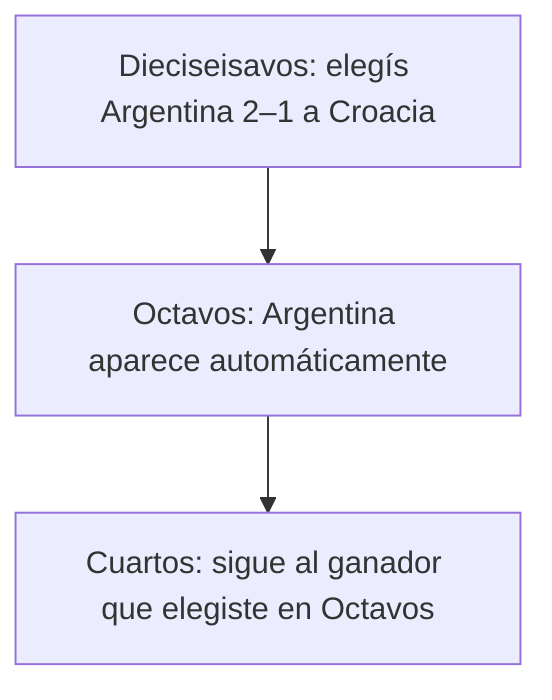

Esta guía explica todo lo relacionado con los plazos de predicción: cuándo ocurren, cómo se ven en la app y qué hacer cuando un cruce aún no se decidió.

## Los tres estados de una predicción

Cuando abrís un Juego, cada partido (fase de grupos o eliminatoria) muestra uno de tres estados:

<CardGroup cols={3}>
  <Card title="Pendiente" icon="hourglass-half">
    El cruce no está definido todavía. Una o ambas selecciones siguen POR DEFINIR. Vas a poder predecir cuando los partidos previos confirmen quién juega contra quién.
  </Card>
  <Card title="Abierta" icon="circle-check">
    Podés enviar o editar tu predicción.
  </Card>
  <Card title="Cerrada" icon="lock">
    El plazo ya pasó. Tu predicción (si la enviaste) es definitiva.
  </Card>
</CardGroup>

Cada partido en tu lista de predicciones tiene un indicador visual claro que muestra en qué estado está.

## ¿Cuándo se cierra cada partido?

Depende de lo que haya elegido el organizador de tu Juego al configurarlo. Los Juegos usan una de estas opciones:

### Por partido
Cada partido se cierra **al iniciar**. Podés predecir hasta el momento exacto en que arranca.

### Inicio de etapa
Todos los partidos de una etapa se cierran al mismo tiempo — **cuando arranca el primer partido de la etapa**. Así que en cuanto empieza el primer partido de grupos, todas las predicciones de grupos se cierran a la vez.

### Personalizado
Todos los partidos de una etapa se cierran en una **fecha específica** que eligió el organizador. Vas a ver la fecha exacta arriba de la etapa en tu pantalla de predicciones.

### Bracket en Cascada
Tu Juego tiene **un único plazo para todo el bracket**, para todas las predicciones eliminatorias. Por defecto está fijado al inicio del primer partido eliminatorio. (Los Juegos en modo Bracket en Cascada funcionan muy diferente — seguí leyendo.)

<Tip>
¿No sabés qué modo usa tu Juego? Abrí la pantalla principal del Juego — el modo de cierre aparece arriba de la pestaña de predicciones, junto con el próximo plazo.
</Tip>

## Juegos en modo Bracket en Cascada

Si tu Juego es Bracket en Cascada, lo vas a ver claramente en la pantalla principal. La experiencia es lo suficientemente distinta como para tener su propia sección.

### Cómo se predice el bracket

Predecís **todo el bracket eliminatorio de una sola vez**, antes de que arranque cualquier partido eliminatorio. Elegís un ganador *y* un marcador para cada llave de Dieciseisavos; ese ganador aparece automáticamente en tu llave de Octavos; el ganador de Octavos cae en cascada a tu llave de Cuartos; y así hasta la final.



Las predicciones de marcador son obligatorias en cada ronda, igual que en cualquier otro modo de Toqui. La cascada solo controla *qué* cruce aparece en cada llave río abajo — vos seguís eligiendo el marcador.

### ¿Y si cambio de opinión sobre una elección anterior?

Si cambiás una elección de Dieciseisavos después de haber llenado Octavos, la llave de Octavos que dependía de esa elección se **limpia** para que vuelvas a elegir. Hacemos esto porque el cruce que originalmente predijiste ya no tiene sentido — ese equipo ya no está ahí.

Podés seguir cambiando de opinión hasta el plazo del bracket. Después del plazo, tu bracket es definitivo.

### ¿Cuándo se cierra el bracket?

**Al inicio del primer partido eliminatorio.** Apenas arranca ese partido, todo tu bracket queda congelado — no hay más cambios en ninguna elección, en ninguna ronda.

<Warning>
Este es un **único plazo para todas las predicciones eliminatorias** — desde Dieciseisavos hasta la final. Si lo perdés, no podés predecir ningún partido eliminatorio por el resto del torneo.
</Warning>

## Por qué algunos cruces aparecen POR DEFINIR

Los cruces eliminatorios dependen de resultados previos. Hasta que esos resultados lleguen, el cruce figura como POR DEFINIR y todavía no se puede predecir.

**Confirmamos los cruces 2 horas después de que termina cada partido alimentador.** El delay le da tiempo a nuestro proveedor de datos para verificar el resultado oficial antes de actualizar tu bracket.

Así que si un partido de grupos termina a las 10pm, las llaves eliminatorias que dependen de él pasan a ser predecibles cerca de la medianoche.

### La ventana de transición — cuando el tiempo se pone justo

El momento más ajustado de cualquier torneo es **la transición de la fase de grupos a la eliminatoria**. Así se ve una transición típica del Mundial:

```
 27 de junio                                28 de junio
─────────────────────────────────────────────────────────
 ~7pm        ~10pm     medianoche                12pm
  │            │          │                        │
  ▼            ▼          ▼                        ▼
 Arranca    Termina    Últimos                 Plazo del
 último     el         cruces de               bracket +
 partido    partido    Dieciseisavos           arranca
 de grupos             confirmados             Dieciseisavos
                       (2h después)
```

Si estás en un Juego en **modo Bracket en Cascada**, tenés desde la medianoche hasta el mediodía — alrededor de **12 horas** — para terminar cualquier llave del bracket que dependiera de ese último partido de grupos. La mayor parte es de noche, así que **planeá estar online la mañana del primer día de Dieciseisavos y dejá tu bracket listo antes del mediodía.**

Si estás en un Juego **no-cascada**, tenés la misma ventana de medianoche a mediodía para esos partidos puntuales, pero perderla solo te cuesta esos partidos — el resto de tus predicciones de la etapa no se ven afectadas.

<Info>
Enviamos notificaciones 24 horas antes de los plazos del bracket y los inicios de etapa, para que no tengas que acordarte de cada fecha de memoria. Pero no las uses como tu única red de seguridad.
</Info>

## Preguntas frecuentes

<AccordionGroup>
  <Accordion title="¿Qué pasa si me pierdo un plazo?">
    Las predicciones que hayas enviado antes del plazo siguen contando. Los partidos que no predijiste simplemente suman 0 puntos — no hay penalización adicional a tu puntaje total más allá de la oportunidad perdida.
  </Accordion>
  <Accordion title="¿Por qué un cruce sigue POR DEFINIR si el partido ya terminó?">
    Esperamos 2 horas después de que termina un partido alimentador antes de actualizar el cruce. El delay le da tiempo a nuestro proveedor de datos para confirmar el resultado oficial. Si pasaron más de 2 horas y la llave sigue POR DEFINIR, refrescá — la actualización puede acabar de llegar.
  </Accordion>
  <Accordion title="¿Puedo cambiar mi predicción después de enviarla?">
    Sí, en cualquier momento antes de su cierre. Cuenta tu envío más reciente.
  </Accordion>
  <Accordion title="El organizador cambió las reglas — ¿qué pasa con mis predicciones?">
    Los organizadores (y los administradores del Juego) pueden ajustar las reglas en cualquier momento del torneo. Tus predicciones enviadas nunca se borran. Si cambian **cuándo se cierran las predicciones**, los nuevos plazos aplican desde ese momento y tus puntos no cambian. Si cambian la **puntuación** después de que ya se jugaron partidos, Toqui recalcula cada puntaje con las nuevas reglas, así que tus puntos y tu posición pueden subir o bajar — y recibirás una notificación que nombra a quien hizo el cambio.
  </Accordion>
  <Accordion title="¿Por qué cambiaron mis puntos o mi posición?">
    El motivo más común es que el organizador de tu Juego (o un administrador) actualizó las reglas de puntuación. Cuando cambia la puntuación, Toqui recalcula cada partido ya jugado, así que las posiciones pueden moverse. Conviene revisar tus notificaciones — habrá una que nombra a quien cambió la puntuación. (Que lleguen nuevos resultados es la otra razón normal por la que se mueve la tabla.)
  </Accordion>
</AccordionGroup>
